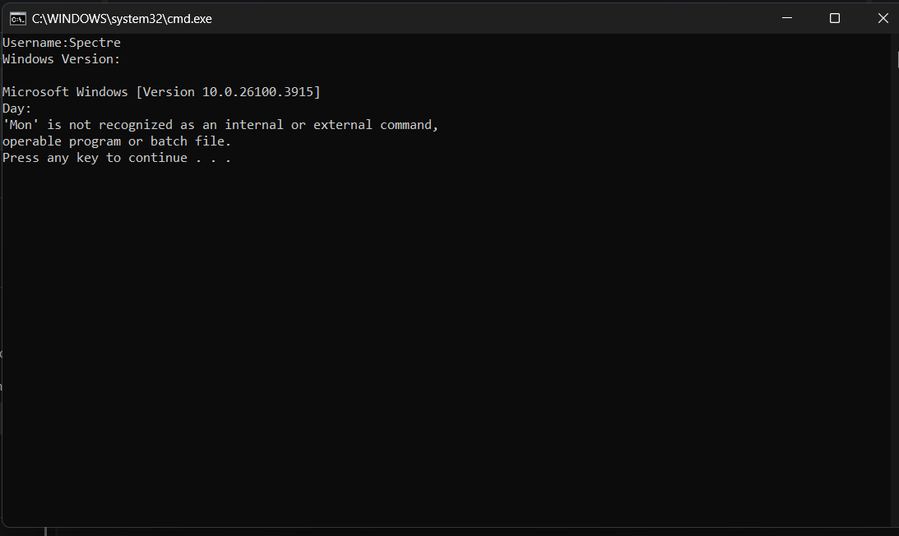
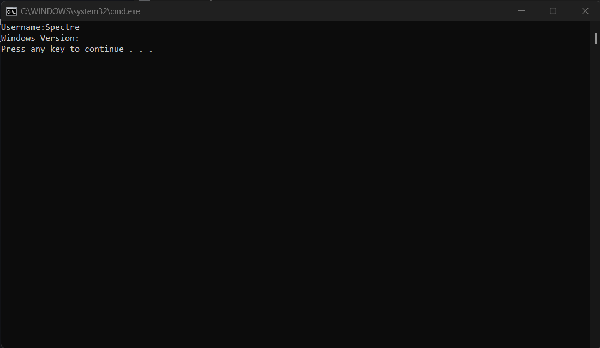
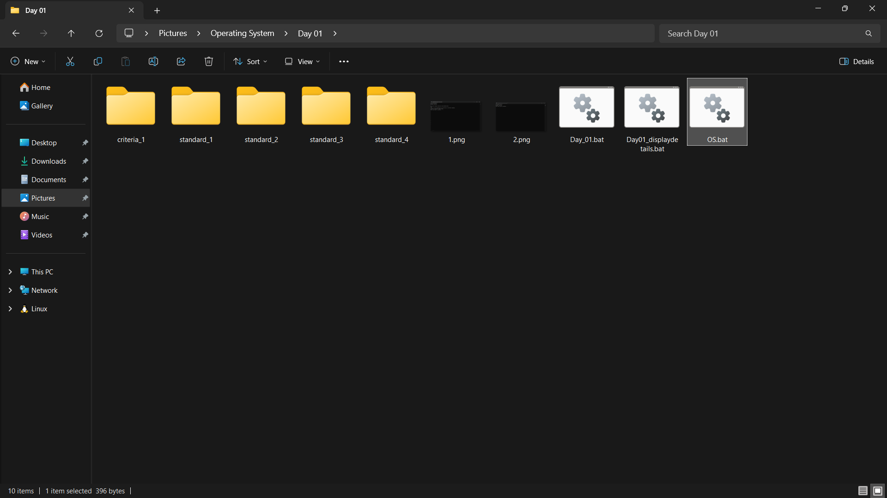

# Operating System Course - Day 01

[](https://learn.microsoft.com/en-us/windows-server/administration/windows-commands/windows-commands)
[](https://www.microsoft.com/windows)
[]()
[]()

> 📚 A comprehensive collection of daily practical lessons for Operating System course focusing on Windows batch scripting.

## 📋 Course Overview

This repository contains practical exercises and implementations for the Operating System course. Each lesson is organized with batch scripts and their corresponding outputs.

## 🗓️ Day 01 Content

### 🎯 Learning Materials

#### 📝 Code Explanations

**Day_01.bat**
```batch
@echo off          # Suppress command display
echo Username:%USERNAME%  # Display current user
echo Windows Version:     # Output header text
ver                  # Show Windows version
echo Day:            # Date section header
%date%               # Display system date
pause               # Keep window open
```

**Day01_displaydetails.bat**
```batch
@echo off
color 2             # Set console to green
echo Username:%USERNAME%  # Show current user
echo Windows Version:  # Version header
ver | find "Version"  # Filter version info
time /t              # Display current time
pause
color 7             # Reset to white
```

- `Day_01.bat` - Main batch script for day 1
- `Day01_displaydetails.bat` - Display system details script
- `OS.bat` - Operating system related commands
- Various standard directories for different criteria

### 📊 Implementation Structure

| Category | File | Description | Visual Output |
|----------|------|-------------|---------------|
| Main Script | `Day_01.bat` | Primary batch script implementation |  |
| System Info | `Day01_displaydetails.bat` | System details display script |  |
| OS Commands | `OS.bat` | Operating system command demonstrations |  |

### 📁 Directory Structure

| Criteria | Standards | Purpose |
|----------|-----------|---------|
| 1 | 1-4 | Basic command operations |
| 2 | 1-4 | File system management |
| 3 | 1-4 | Process control |
| 4 | 1-4 | User account operations |
| 5 | 1-4 | System configuration |

```
📦Day 01 03.10
├── criteria_1/
│   ├── standard_1/ - Basic file operations
│   ├── standard_2/ - Directory management
│   ├── standard_3/ - System info commands
│   └── standard_4/ - Batch scripting
├── criteria_2/
│   ├── standard_1/ - NTFS permissions
│   └── standard_2/ - File auditing
...
```

- `criteria_1/` - First criteria implementations
- `standard_1/` - Standard one exercises
- `standard_2/` - Standard two exercises
- `standard_3/` - Standard three exercises
- `standard_4/` - Standard four exercises


### 🔍 Technical Notes

- **Permission Modifications**:
  ```batch
  icacls files /grant:r USER:(R,W)
  attrib +h secret_file.txt
  ```
- **User Management**:
  ```batch
  net user JohnDoe /add
  net localgroup Administrators JohnDoe /add
  ```
- **Command Chaining**:
  ```batch
  dir & echo Completed listing && pause
  copy *.txt backup\ /v | find "file(s)"
  ```

- All implementations are in Windows Batch Script
- Each script includes comprehensive command demonstrations
- Visual outputs are captured for reference
- Consistent script formatting and naming conventions

---

<div align="center">

📖 **Learning Path** | 🛠️ **Practical Examples** | 📊 **Visual Outputs**

</div>
